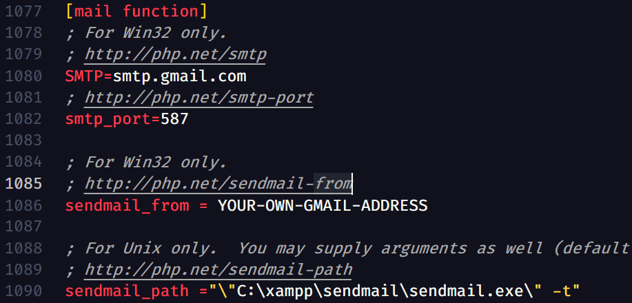
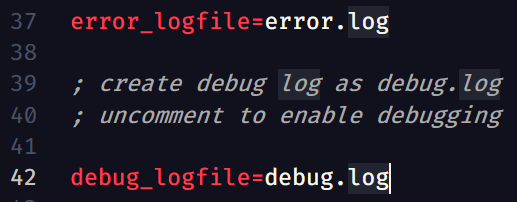
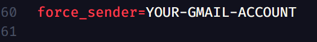

# Parent-Teachers-Portal

## ✨ Introduction
In this project, we have created a website that helps teachers send direct messages to student's parents. For this, we have used HTML and CSS for the front-end, PHP for the back-end, and for the dynamic update for the notices we have used JAVASCRIPT.

## 🔰 Installation:
1. You must have any server installed on your PC. In my case it was XAMPP.
2. You have to create a database name "ptp" and upload the sql file provided.
3. For sending mails, you have to configure 2 files which are located in php and sendmail folder, under xampp folder.
4. Go to `C:/xampp/php/php.ini` file, open it in any code editor, edit the code as shown below:
   
5. Go to `C:/xampp/sendmail/sendmail.ini` file, open it in any code editor, edit the code as shown below:
   
   
   
   
6. Now, you have to make that gmail account less secure so that php can use that to send mails.
7. Last step, some of the php files you have to configure all "YOUR-EMAIL-ADDRESS" text to your particular email-address.

## 💡 Features:
1. Complete form validation and authentication.
2. If the user forgets the password, added forgot-password form to reset the password.
3. Password is stored in encrypted format.
4. Notices we be refresh automatically after 2mins with reloading the page.
5. Dynamic search bar.
6. Easy to use and best user experience.

## About creator
### Varshil Shah
Feel free to mail me at my email address [varshilshah1004@gmail.com](mailto:varshilshah1004@gmail.com) for any queries.
